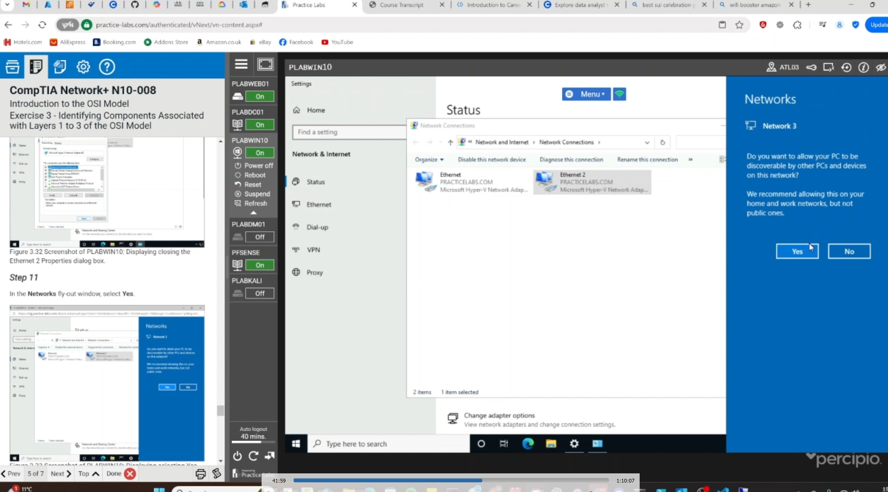

# **Lab Report: Introduction to the OSI Model**

**Author:** *Joshua Ayeni*  
**Date Completed:** *19/04/2025*  
**Lab Title:** Introduction to the OSI Model  
**Lab Duration:** ~1 Hour  

---

## **Table of Contents**
1. [Introduction](#introduction)  
2. [Learning Objectives](#learning-objectives)  
3. [Lab Summary](#lab-summary)  
4. [Exercises](#exercises)  
    - Exercise 1: OSI Model Structure & Functionality  
    - Exercise 2: Data Encapsulation and Decapsulation  
    - Exercise 3: Identifying Components in Layers 1-3  
    - Exercise 4: Identifying Components in Layers 4-7  
5. [Conclusion](#conclusion)  
6. [Screenshots](#screenshots)  
7. [References](#references)

---

## **Introduction**

This lab provided a hands-on introduction to the OSI (Open Systems Interconnection) model, which is fundamental for understanding network architecture and communication protocols. It focused on exploring each of the seven OSI layers, their functions, and how data travels through them via encapsulation and decapsulation processes.

---

## **Learning Objectives**

By completing this lab, I achieved the following objectives:

- Understand the structure and role of the OSI model and its comparison to the TCP/IP model.
- Learn how data encapsulation and decapsulation work within the OSI framework.
- Identify key hardware and software components associated with each OSI layer.
- Gain practical exposure using virtualized devices to explore networking concepts.

---

## **Lab Summary**

The lab was divided into four main exercises:

1. **Structure and Functionality of the OSI Model**
2. **Data Encapsulation and Decapsulation**
3. **Components of OSI Layers 1-3**
4. **Components of OSI Layers 4-7**

Each section involved a series of guided steps using a virtual environment to observe network behaviors and configurations at each OSI layer.

---

## **Exercises**

### **Exercise 1: Structure and Functionality of the OSI Model**

We explored the seven layers of the OSI model and their individual purposes. I noted how layers like the Physical and Data-Link layers focus on transmission and addressing, while higher layers (like Application and Presentation) are more user-focused.

#### 📸 *Diagram of OSI Model:*

 

#### 📸 *TCP/OSI Table:*

*

📌 *Key Takeaway:* The OSI model is theoretical but foundational for understanding real-world network operations.

---

### **Exercise 2: Data Encapsulation and Decapsulation**

This part explained how data is wrapped (encapsulated) as it travels from the Application layer down to the Physical layer, and how it's unwrapped (decapsulated) when received.

#### 📸 *Data Encapsulation Steps:*

*
#### 📸 *Data Decapsulation Steps A:*

*
#### 📸 *Data Decapsulation Steps B:*

*

📌 *Key Takeaway:* Each layer adds or removes headers/footers, enabling structured communication and error handling.

---

### **Exercise 3: Identifying Components in Layers 1-3**

Using PLABWIN10, we:

- Inspected physical network adapters (Layer 1)  
- Viewed MAC addresses and drivers (Layer 2)  
- Assigned IP addresses and configured routing (Layer 3)

#### 📸 *Network Layer:*

#### 📸 *Network Layer (Active):*

#### 📸 *Network Driver:*

#### 📸 *Network Config *CLI Interface* showing Logical/Physical Address:*

#### 📸 *CLI Interface showing ARP Table:*

#### 📸 *CLI Interface showing IP Details:*

#### 📸 *Manually Updating TCP/IPv4 details on Ethernet 2:*

#### 📸 *Automatic Prompt after change:*

#### 📸 *CLI Interface showing updated IP:*

#### 📸 *CLI Interface Adding IP route Manually:*

#### 📸 *CLI Interface Route Print:*

#### 📸 *CLI Interface IP Ping Test:*

📌 *Key Takeaway:* These layers form the foundation of device-to-device communication and routing.

---

### **Exercise 4: Identifying Components in Layers 4-7**

We explored how:

- TCP and UDP protocols operate at Layer 4  
- Applications like web browsers utilize Layers 5-7  

Commands like `netstat` revealed active connections and protocols.

#### 📸 *CLI Interface Netstat Command for TCP protocol:*

#### 📸 *CLI Interface Netstat Command Showing TCP protocol Traffic due to opened browser and page:*

#### 📸 *CLI Interface Netstat Command for UDP protocol:*

#### 📸 *Task Manager showing background processes for open applications:*

📌 *Key Takeaway:* Layers 4-7 handle the logic and interaction of services running over the network.

---

## **Conclusion**

This lab gave me hands-on experience with the OSI model, helping bridge the gap between theory and practical application. By interacting with virtual machines and network settings, I now better understand how communication happens from wire to web browser.

---

---

## **References**

- Practice Labs: Introduction to OSI Model  
- CompTIA Network+ (N10-008) objectives  
- Official OSI documentation from ISO
- Media Edit: OBS Studio, Microsft 365 Co-pilot Suite.
